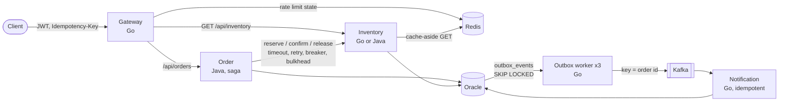

# Architecture

## Request path

| Service | Language | Port (host) | Role | ADR |
|---|---|---|---|---|
| gateway | Go | 8088 | JWT login, IP and user rate limit, circuit breaker per upstream, reverse proxy | 0008 |
| ratelimiter-go / -java | Go / Java | 8081 / 8082 | Standalone rate limiter (token bucket, sliding window, fixed window) on Redis + Lua | 0002 |
| inventory-go / -java | Go / Java | 8083 / 8084 | Reserve / release / confirm stock, three anti-oversell strategies, cache-aside | 0003, 0004 |
| order | Java | 8085 | Idempotent order creation, orchestration saga, transactional outbox | 0005 |
| outbox-worker | Go | (none) | Relays `outbox_events` to Kafka, competing workers with SKIP LOCKED | 0006 |
| notification | Go | 8087 | Kafka consumer, exactly one notification per event (inbox table) | 0007 |

inventory-go and inventory-java are interchangeable: same table, same HTTP contract, same contract test suite
(`contract-tests/`). The order service picks one with `INVENTORY_URL` (`make up-apps INVENTORY_IMPL=go|java`).

## One order, step by step

1. **Gateway**: verifies the JWT, applies the IP and the per-user limit, forwards with `X-User-Id` taken from the token.
2. **Order, transaction 1**: insert `orders` (PENDING) + `order_item` + `outbox_events(ORDER_CREATED)`. A duplicate
   `(user, Idempotency-Key)` hits the unique constraint and returns the stored result instead.
3. **Saga** (no database connection held): reserve every item at inventory (idempotent per order + sku), charge the
   simulated payment, confirm every item. A failure before the payment releases what was reserved.
4. **Order, transaction 2**: final status + `ORDER_CONFIRMED` / `ORDER_FAILED` event, written by exactly one request.
5. **Outbox worker**: claims the events, publishes them to Kafka keyed by order id (order kept per order), marks SENT.
6. **Notification**: records the event id and the notification in one transaction; redeliveries are no-ops.

## Correctness guarantees and where they are tested

| Guarantee | Mechanism | Tested by |
|---|---|---|
| No oversell | conditional `UPDATE ... WHERE available >= :n` (or FOR UPDATE / version check) | contract test: 2000 buyers, 100 units; load test reconcile |
| A retried order is not created twice | unique `(user_id, idempotency_key)` | order API tests (20 concurrent same key), load test (15% retries) |
| A reservation is taken once | unique `(order_id, product_id)` | contract test: 50 concurrent identical reserves |
| Stock never leaks | saga compensation, payment as pivot, resumable PENDING orders | order tests, `make chaos` |
| No order stays PENDING | recovery job resumes abandoned orders, one claimer per order | order tests (recovery, 8 concurrent claims), load test reconcile |
| An event exists iff the order change committed | transactional outbox | order tests, reconcile (2 events per order) |
| No event lost, order kept per order | SKIP LOCKED claim, ordering gate, at-least-once | outbox integration tests, `make e2e-outbox` (worker killed) |
| One notification per event | inbox table, offset committed after handling | notification tests, reconcile |

## Infrastructure

`make up` starts Oracle Free, Redis, Kafka (KRaft), Prometheus, Grafana and Jaeger; `make up-apps` builds and starts the
services (every app container limited by `APP_CPUS` / `APP_MEM`). Observability: `docs/adr/0009-observability.md`.
