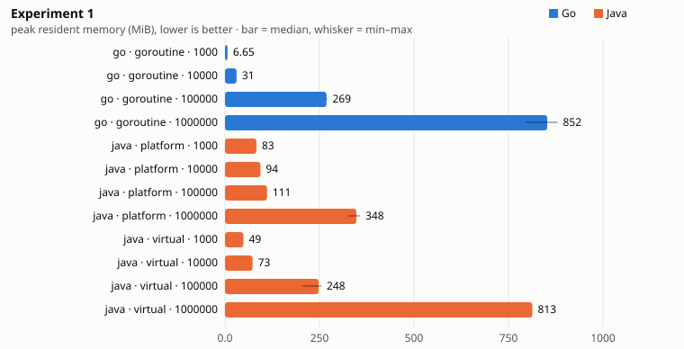
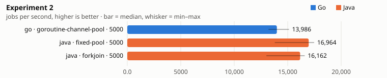
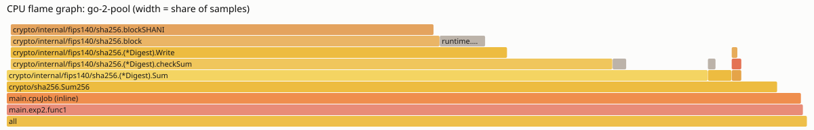
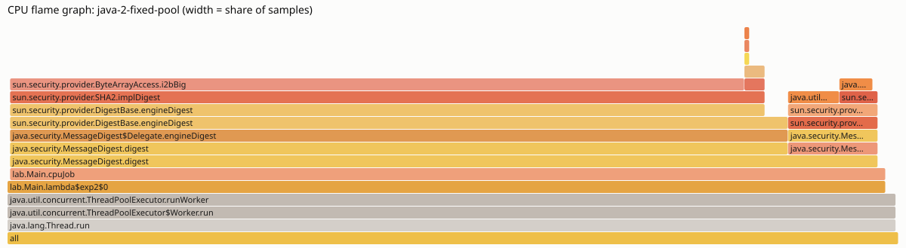
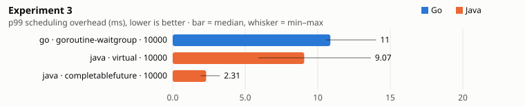
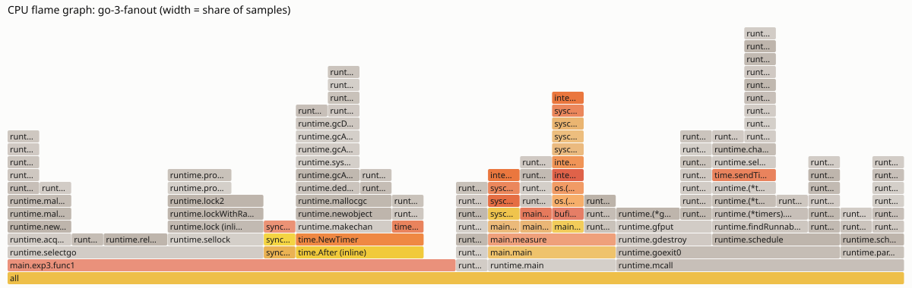
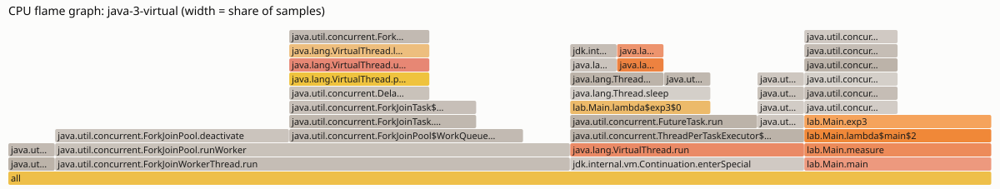
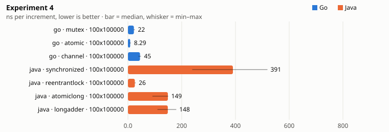
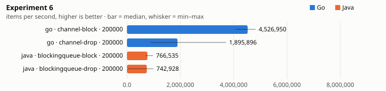
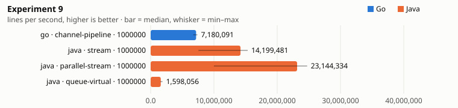

<!-- Generated by labs/concurrency-lab/report.mjs from report-template.md: edit the template, then `make lab-report`. -->
# Concurrency in Go and Java: ten experiments

The same ten experiments written twice, in Go 1.26 and in Java 25, run with the same parameters in containers with the
same limits (2 CPUs, 3 GiB), each run a separate process with one warm-up and five measured repetitions. Code:
`labs/concurrency-lab/`. Numbers are medians with [min–max] and the standard deviation; charts show the median and the
min–max range. A laptop is a noisy place: read differences under ~20% as "about the same".

**In one paragraph.** Go's goroutines and channels make the common cases short and fast: a million sleeping tasks,
a bounded queue, cancellation through `context`, and a race detector that finds data races deterministically. Java 25
has closed most of the gap for I/O concurrency with virtual threads (a million sleeping tasks in 2 s, same memory as Go),
and wins clearly in places: CPU-bound hashing, a data pipeline written with streams, and diagnosis (the JVM finds a
deadlock by itself in about 1 ms). Platform threads remain the expensive option: a million of them took 143 s.

## Setup

```
go version go1.26.8 linux/amd64
GOMAXPROCS: runtime default, cgroup-aware since Go 1.25 (effective value: metrics.workers of experiment 2)
GOGC=100
cpus=2 mem=3g
```

```
openjdk version "25.0.4.1" 2026-08-18 LTS
OpenJDK Runtime Environment Temurin-25.0.4.1+1 (build 25.0.4.1+1-LTS)
OpenJDK 64-Bit Server VM Temurin-25.0.4.1+1 (build 25.0.4.1+1-LTS, mixed mode, sharing)
flags: --enable-preview, default GC UseG1GC (JVM ergonomics for 2 CPUs, 3 GiB)
cpus=2 mem=3g
```

Measurement method, compared with what the plan asked for:

- Same harness in both languages: warm-up, then 5 repetitions, wall time, process CPU time, peak RSS (`VmHWM` from
  `/proc`, the same source for both). It replaces JMH and `testing.B` + `benchstat`, which the plan suggested: the
  experiments are whole-program scenarios (thread creation, queues, cancellation), not microbenchmarks of one method,
  and one harness keeps the two sides strictly comparable. JMH would be the right tool for experiment 4 alone.
- Experiment 4 runs 100 threads x 100 000 increments (10 M operations) instead of 100 x 1 M, to keep each repetition
  under a few seconds; the result is reported per operation.
- Profiles: Go `pprof` (CPU), Java JFR (`settings=profile`), drawn as flame graphs by `labs/concurrency-lab/flame.mjs`.

## Code size

| # | Go code lines | Java code lines |
|---|---:|---:|
| 1 | 12 | 30 |
| 2 | 30 | 44 |
| 3 | 30 | 34 |
| 4 | 63 | 56 |
| 5 | 52 | 24 |
| 6 | 49 | 58 |
| 7 | 25 | 47 |
| 8 | 31 | 53 |
| 9 | 59 | 69 |

Code lines of each experiment (blank and comment lines excluded); the harness (timing, JSON) is not counted.

---

## 1. One task per unit of work: 1k to 1M tasks sleeping 100 ms

| Language | Variant | Parameter | wall ms | peak RSS MiB | CPU ms |
|---|---|---|---:|---:|---:|
| go | goroutine | 1000 | 101 [101–101] ±0 | 7 [6–7] ±0 | 1 [1–1] ±0 |
| go | goroutine | 10000 | 104 [103–106] ±1 | 31 [30–31] ±0 | 14 [11–17] ±2 |
| go | goroutine | 100000 | 137 [136–144] ±3 | 269 [267–270] ±1 | 121 [116–151] ±13 |
| go | goroutine | 1000000 | 1168 [1036–1286] ±92 | 852 [796–880] ±30 | 1913 [1770–2079] ±118 |
| java | platform | 1000 | 211 [208–277] ±27 | 83 [83–83] ±0 | 170 [150–270] ±43 |
| java | platform | 10000 | 1487 [1401–1784] ±138 | 94 [94–94] ±0 | 1930 [1850–2450] ±223 |
| java | platform | 100000 | 15,139 [14,208–15,580] ±497 | 111 [111–111] ±0 | 21,130 [19,760–22,120] ±840 |
| java | platform | 1000000 | 143,425 [137,308–145,707] ±2914 | 348 [327–357] ±12 | 200,810 [190,790–205,200] ±4992 |
| java | virtual | 1000 | 105 [104–106] ±1 | 49 [49–49] ±0 | 20 [20–30] ±4 |
| java | virtual | 10000 | 113 [110–116] ±2 | 73 [73–73] ±0 | 90 [50–130] ±26 |
| java | virtual | 100000 | 206 [194–275] ±30 | 248 [205–255] ±19 | 390 [320–470] ±53 |
| java | virtual | 1000000 | 2090 [1976–2105] ±58 | 813 [813–813] ±0 | 4180 [3890–4230] ±142 |

Median of the measured repetitions, [min–max] ±standard deviation.



```go
for range n {                                  // Go
    go func() { defer wg.Done(); time.Sleep(100 * time.Millisecond) }()
}
```
```java
Thread.Builder b = Thread.ofVirtual();          // Java: or Thread.ofPlatform()
for (int i = 0; i < n; i++) threads.add(b.start(() -> sleep(100)));
```

Go 12 code lines, Java 30 code lines.

- **Goroutines and virtual threads behave alike**: a million tasks finish in about 1–2 s and use about 800 MiB at peak in
  both languages. Both are scheduled M:N on a few OS threads, and a parked task costs a small heap-allocated stack.
- **Platform threads did not crash, they were slow.** Creating an OS thread costs about 140 µs here, so at most a few
  hundred were alive at once (each sleeps only 100 ms): memory stayed low (350 MiB at 1 M) but one million took 143 s
  instead of 0.1 s. With longer-lived tasks they would pile up and hit the thread or memory limit instead.
- Pitfalls: a goroutine that never returns is a leak nobody reports (see 8); `ThreadLocal` on a million virtual threads
  means a million copies; virtual threads are for waiting, not for CPU work (see 2).

## 2. Worker pool for CPU-bound jobs (5 000 x 2 000 SHA-256 rounds)

| Language | Variant | Parameter | jobs/s | CPU use (of 2) | peak RSS MiB |
|---|---|---|---:|---:|---:|
| go | goroutine-channel-pool | 5000 | 13,986 [13,204–15,122] ±800 | 0.94 [0.93–0.94] ±0.00 | 4 [4–4] ±0 |
| java | fixed-pool | 5000 | 16,964 [13,794–17,474] ±1337 | 1.00 [0.97–1.02] ±0.01 | 181 [180–181] ±1 |
| java | forkjoin | 5000 | 16,162 [13,007–16,587] ±1302 | 0.98 [0.97–1.00] ±0.01 | 141 [139–142] ±1 |

Median of the measured repetitions, [min–max] ±standard deviation.



```go
in := make(chan int, workers*2)                 // Go: GOMAXPROCS workers reading a channel
for range workers { go func() { for j := range in { cpuJob(j, rounds) } }() }
```
```java
try (ExecutorService pool = Executors.newFixedThreadPool(CPUS)) {   // Java
    for (int j = 0; j < jobs; j++) pool.execute(() -> cpuJob(j, rounds));
}
```

Go 30 code lines, Java 44 code lines.

- **Java is faster here** (about 17 000 vs 14 000 jobs/s, both at ~100% of the 2 CPUs). The flame graphs show why it is
  not about the scheduler: almost all samples are in the SHA-256 block function in both, and HotSpot's intrinsic for
  SHA-256 beats Go's assembly on this CPU. ForkJoinPool and a fixed pool are equivalent for independent jobs.
- **Go uses 4 MiB, Java 140–180 MiB** for the same work: the cost of a JVM with JIT, class metadata and a sized heap.
- Pool size = CPU count in both: Go reads the cgroup quota (since 1.25 `GOMAXPROCS` respects container limits), the JVM
  too (`availableProcessors()` = 2).





## 3. Fan-out of 10 000 I/O calls (50–200 ms simulated latency)

| Language | Variant | Parameter | total ms | overhead p50 ms | overhead p99 ms | peak RSS MiB |
|---|---|---|---:|---:|---:|---:|
| go | goroutine-waitgroup | 10000 | 211 [211–215] ±1 | 3.56 [3.52–4.88] ±0.52 | 10.87 [10.58–14.02] ±1.28 | 36 [36–36] ±0 |
| java | virtual | 10000 | 210 [207–215] ±3 | 5.42 [3.85–8.05] ±1.51 | 9.07 [5.90–13.66] ±2.95 | 109 [109–109] ±0 |
| java | completablefuture | 10000 | 204 [203–204] ±1 | 1.19 [0.95–1.41] ±0.16 | 2.31 [1.94–3.25] ±0.46 | 80 [80–80] ±0 |

Median of the measured repetitions, [min–max] ±standard deviation.



```go
go func() { select { case <-time.After(lat[i]): case <-ctx.Done(): return } }()   // Go
```
```java
ex.submit(() -> { Thread.sleep(latencyMs(k)); return null; });                    // Java, virtual threads
CompletableFuture.runAsync(task, CompletableFuture.delayedExecutor(lat, MILLISECONDS)); // Java, async
```

Go 30 code lines, Java 34 code lines.

- All three finish in about 205–210 ms, i.e. the slowest call: fan-out works in all of them.
- **Overhead** (finish time minus the simulated latency) is lowest with CompletableFuture timers (p99 ~2 ms): nothing
  blocks, one timer thread completes the futures. Goroutines and virtual threads are close (p99 ~9–11 ms): 10 000
  tasks wake up on 2 CPUs and queue for a carrier.
- Readability goes the other way: blocking code in a goroutine or a virtual thread reads top to bottom;
  CompletableFuture chains need care for errors and cancellation.





## 4. Shared counter, 100 threads x 100 000 increments

| Language | Variant | Parameter | ns/op | exact result | CPU use |
|---|---|---|---:|---:|---:|
| go | mutex | 100x100000 | 22.1 [21.2–25.6] ±1.5 | 1 [1–1] ±0 | 0.99 [0.99–1.00] ±0.00 |
| go | atomic | 100x100000 | 8.3 [6.0–10.9] ±1.6 | 1 [1–1] ±0 | 1.00 [1.00–1.00] ±0.00 |
| go | channel | 100x100000 | 44.8 [39.2–48.4] ±3.2 | 1 [1–1] ±0 | 0.96 [0.94–0.97] ±0.01 |
| java | synchronized | 100x100000 | 390.5 [239.2–519.1] ±89.7 | 1 [1–1] ±0 | 0.99 [0.99–1.00] ±0.00 |
| java | reentrantlock | 100x100000 | 25.5 [25.3–28.8] ±1.3 | 1 [1–1] ±0 | 0.72 [0.71–0.82] ±0.04 |
| java | atomiclong | 100x100000 | 148.5 [91.1–149.7] ±22.6 | 1 [1–1] ±0 | 0.98 [0.94–1.04] ±0.03 |
| java | longadder | 100x100000 | 148.3 [109.8–179.7] ±24.7 | 1 [1–1] ±0 | 0.99 [0.94–1.01] ±0.03 |

Median of the measured repetitions, [min–max] ±standard deviation.



```go
mu.Lock(); c++; mu.Unlock()        // Go mutex        c.Add(1)            // Go atomic
```
```java
synchronized (lock) { c[0]++; }    // Java            counter.increment(); // LongAdder
```

Go 63 code lines, Java 56 code lines.

- Every variant is exact; the cost differs by more than 40x.
- **Go looks much faster for the same primitive** (atomic 8 ns vs Java AtomicLong ~150 ns). This measures the schedulers
  as much as the instructions: 100 goroutines share 2 Ps and mostly run one after another for a whole time slice, with
  little real contention; 100 Java platform threads are 100 OS threads fighting for 2 CPUs, with context switches and
  cache-line ping-pong. LongAdder does not help with only 2 cores.
- `synchronized` was the slowest and the noisiest (240–520 ns); ReentrantLock (26 ns) is on par with Go's Mutex.
- A channel used as a lock (one owner goroutine) is correct and simple but about 5x slower than an atomic.

## 5. A data race on purpose, then the fix

| Language | Variant | Parameter | race detected | ms | runs with lost updates | race reports | fix passes |
|---|---|---|---:|---:|---:|---:|---:|
| go | go-test-race | — | 1 | 385 | — | 2 | 1 |
| java | unsynchronized-repeat | 100 | 0 [0–1] ±0 | 75 [72–94] ±8 | 0 [0–1] ±0 | — | — |

Median of the measured repetitions, [min–max] ±standard deviation.

```go
for range perG { n++ }   // the bug, in both languages: unsynchronised read-modify-write
```

Go 52 code lines, Java 24 code lines.

- **Go**: `go test -race` reported the race on the first run (`WARNING: DATA RACE` with both stacks) and the fixed
  version passes. The detector instruments memory accesses, so it finds races that did not corrupt anything yet.
- **Java has no race detector in the JDK.** Running the racy code 100 times found lost updates in only 0–1 of the 100
  runs: on 2 CPUs the threads rarely interleave inside `c++`. A test that passes is no proof. Java's tools are
  reasoning (the memory model, happens-before) and stress harnesses such as jcstress, which runs millions of trials.
- Verdict: Go is clearly better at finding races; Java offers more ready-made safe structures (`java.util.concurrent`).

## 6. Bounded producer–consumer (capacity 100, 4 producers, 4 consumers, 200 000 items)

| Language | Variant | Parameter | items/s | dropped | producer blocked ms | no loss |
|---|---|---|---:|---:|---:|---:|
| go | channel-block | 200000 | 4,526,950 [4,073,090–4,824,853] ±273,316 | 0 [0–0] ±0 | 39 [37–45] ±3 | 1 [1–1] ±0 |
| go | channel-drop | 200000 | 1,895,896 [880,815–3,714,817] ±970,267 | 193,397 [179,960–197,323] ±6218 | 0 [0–0] ±0 | 1 [1–1] ±0 |
| java | blockingqueue-block | 200000 | 766,535 [699,917–973,029] ±94,288 | 0 [0–0] ±0 | 217 [180–244] ±25 | 1 [1–1] ±0 |
| java | blockingqueue-drop | 200000 | 742,928 [47,097–988,044] ±389,241 | 185,103 [181,797–199,415] ±6187 | 0 [0–0] ±0 | 1 [1–1] ±0 |

Median of the measured repetitions, [min–max] ±standard deviation.



```go
q <- i                                   // Go: blocks while full (backpressure)
select { case q <- i: default: dropped++ }   // Go: never wait, shed load
```
```java
q.put(i);                                // Java: blocks while full
if (!q.offer(i)) dropped++;              // Java: never wait
```

Go 49 code lines, Java 58 code lines.

- **Go's channel moved about 4.5 M items/s, ArrayBlockingQueue about 0.8 M/s.** A channel hand-off between goroutines
  stays inside the Go scheduler; `put`/`take` park and unpark OS threads under a lock.
- Behaviour when full is the same idea in both: blocking spreads backpressure to the producers (the "producer blocked"
  column), non-blocking drops most items when consumers are slower (~185 000 of 200 000 here).
- Pitfalls: closing a Go channel twice panics, and sending on a closed one panics, so only the producer side closes;
  Java has no close, a "poison pill" item ends the consumers (`-1` here).

## 7. Cancellation and timeout: 10 000 running tasks cancelled after 100 ms

| Language | Variant | Parameter | stop after cancel ms | leaked tasks |
|---|---|---|---:|---:|
| go | context | 10000 | 3.93 [3.05–6.16] ±1.08 | 0 [0–0] ±0 |
| java | future-cancel | 10000 | 10.80 [10.13–17.30] ±3.22 | 0 [0–0] ±0 |
| java | structured | 10000 | 30.41 [7.50–39.97] ±12.27 | 0 [0–0] ±0 |

Median of the measured repetitions, [min–max] ±standard deviation.

```go
ctx, cancel := context.WithTimeout(context.Background(), 100*time.Millisecond)
select { case <-ctx.Done(): return; case <-time.After(10 * time.Millisecond): }
```
```java
try (var scope = StructuredTaskScope.open(Joiner.awaitAll(), cf -> cf.withTimeout(Duration.ofMillis(100)))) {
    for (...) scope.fork(() -> steps(exited));
    scope.join();                        // throws TimeoutException; close() waits for every subtask
}
```

Go 25 code lines, Java 47 code lines.

- All three stop every task, none leaks. Go is the fastest to drain (about 4 ms), Java's `Future.cancel(true)` about
  11 ms, StructuredTaskScope about 30 ms (it interrupts each subtask, then waits for all of them in `close()`).
- The models differ: Go's cancellation is **cooperative and explicit** (every function takes a `ctx` and must check it);
  Java's is **interrupt-based** (blocking calls throw InterruptedException, CPU loops must check the flag).
- StructuredTaskScope is still a **preview API in JDK 25** (JEP 505, `--enable-preview`): its shape (tasks cannot outlive
  their scope) is the closest Java gets to Go's errgroup + context.

## 8. Deadlock and leak on purpose, then diagnosis

| Language | Variant | Parameter | detected | time to detect ms | leaked |
|---|---|---|---:|---:|---:|
| go | deadlock | — | 1 [1–1] ±0 | 201 [201–201] ±0 | — |
| go | leak | — | 1 [1–1] ±0 | — | 16 [8–30] ±8 |
| java | deadlock | — | 1 [1–1] ±0 | 1 [1–15] ±6 | — |
| java | leak | — | 1 [1–1] ±0 | — | 994 [991–1000] ±4 |

Median of the measured repetitions, [min–max] ±standard deviation.

Go 31 code lines, Java 53 code lines.

- **Deadlock: Java wins.** The JVM detects lock cycles itself (`ThreadMXBean.findDeadlockedThreads`, the same check as
  `jstack`'s "Found one Java-level deadlock"): found in about 1 ms with both threads named. Go only reports a deadlock
  when every goroutine is blocked ("all goroutines are asleep"); a partial deadlock has to be found by a watchdog and a
  goroutine dump (`pprof` `debug=2`), where we search for goroutines waiting in `sync.(*Mutex).Lock`. Here: 200 ms,
  the watchdog delay.
- **Leak: both visible, neither automatic.** Go's `runtime.NumGoroutine()` / the goroutine profile and Java's thread
  count both show the growth. The numbers differ (Go 8–30 leaked, Java ~1000) because the scheduling races differently:
  in Go the sender often completes before the 1 µs timeout fires. Virtual-thread leaks do not show in the thread count:
  use `jcmd <pid> Thread.dump_to_file`.

## 9. Pipeline parse → transform → write, 1 M lines

| Language | Variant | Parameter | lines/s | ms | CPU use | peak RSS MiB |
|---|---|---|---:|---:|---:|---:|
| go | channel-pipeline | 1000000 | 7,180,091 [6,742,406–7,385,579] ±225,574 | 139 [135–148] ±5 | 0.97 [0.97–0.98] ±0.00 | 92 [92–92] ±0 |
| java | stream | 1000000 | 14,199,481 [7,551,944–15,336,975] ±3,127,101 | 70 [65–132] ±26 | 0.52 [0.49–0.62] ±0.05 | 435 [300–436] ±54 |
| java | parallel-stream | 1000000 | 23,144,334 [9,992,257–24,737,478] ±6,188,548 | 43 [40–100] ±24 | 0.99 [0.95–1.04] ±0.03 | 433 [262–433] ±68 |
| java | queue-virtual | 1000000 | 1,598,056 [1,528,883–1,868,582] ±130,326 | 626 [535–654] ±46 | 0.98 [0.98–1.04] ±0.02 | 226 [222–281] ±23 |

Median of the measured repetitions, [min–max] ±standard deviation.



```go
for r := range parsed { r.total = r.qty * 490; transformed <- r }       // Go: one stage, N goroutines
```
```java
in.parallelStream().map(Main::parse).filter(r -> r != null)                // Java
    .map(r -> new Rec(r.id(), r.sku(), r.qty(), r.qty() * 490)).forEach(r -> { written.increment(); ... });
```

Go 59 code lines, Java 69 code lines.

- **Java streams win clearly** (sequential ~14 M lines/s, parallel ~23 M/s vs Go's channel pipeline ~7 M/s). Streams
  fuse the stages into one loop per element; the Go version pays two channel hand-offs per line. The same design in
  Java (bounded queues between stages) is the slowest of all (1.6 M/s).
- Lesson for Go: channels are for coordinating independent stages, not for the inner loop of data processing; batch
  items or process in a plain loop per worker. Lesson for Java: parallel streams are a one-liner, but they use the shared
  ForkJoin common pool.
- Memory: the Go pipeline peaks at ~90 MiB, the Java variants 220–440 MiB.

## 10. The rate limiter of Phase 1, both languages

| | ratelimiter-go | ratelimiter-java |
|---|---:|---:|
| source files | 4 | 14 |
| code lines (main) | 375 | 309 |
| test files | 2 | 5 |
| code lines (tests) | 354 | 293 |
| shared Lua scripts (identical, counted once) | 49 | 49 |

Counted by report.mjs (blank and comment-only lines excluded), same rule for both languages.

- Same behaviour (shared Lua scripts, same contract tests), similar size: Go 375 lines in 4 files, Java 309 lines in
  14 files. Java spreads the same logic over more, smaller files (one class per strategy, configuration, controller);
  Spring removes the HTTP and JSON plumbing that Go writes by hand. Tests are about the same size.

---

## When to choose which

| Situation | Better fit | Why (from the experiments) |
|---|---|---|
| Many concurrent waits (I/O fan-out, connections) | both: goroutines, or Java 21+ virtual threads | 1, 3: same time and memory |
| Short-lived, small services, fast start, low memory | Go | 2, 9 memory; Phase 6 startup 0.6 s vs 5.6 s |
| CPU-heavy number crunching, data transformation | Java (JIT, intrinsics, streams) | 2, 9 |
| Hand-off between tasks, bounded queues | Go channels | 6 |
| Finding concurrency bugs | Go for races (`-race`), Java for deadlocks and runtime diagnosis (JFR, jstack) | 5, 8 |
| Cancellation through a call tree | Go `context` today; Java StructuredTaskScope once final | 7 |
| Platform threads | only for few, long-lived tasks | 1: creation dominates |

Honest limits: one machine, 2 CPUs, one JDK and one Go version; the JVM untuned (default G1, no CDS); experiment 4
measures scheduler behaviour as much as lock cost; the race experiment in Java depends on luck by design.
